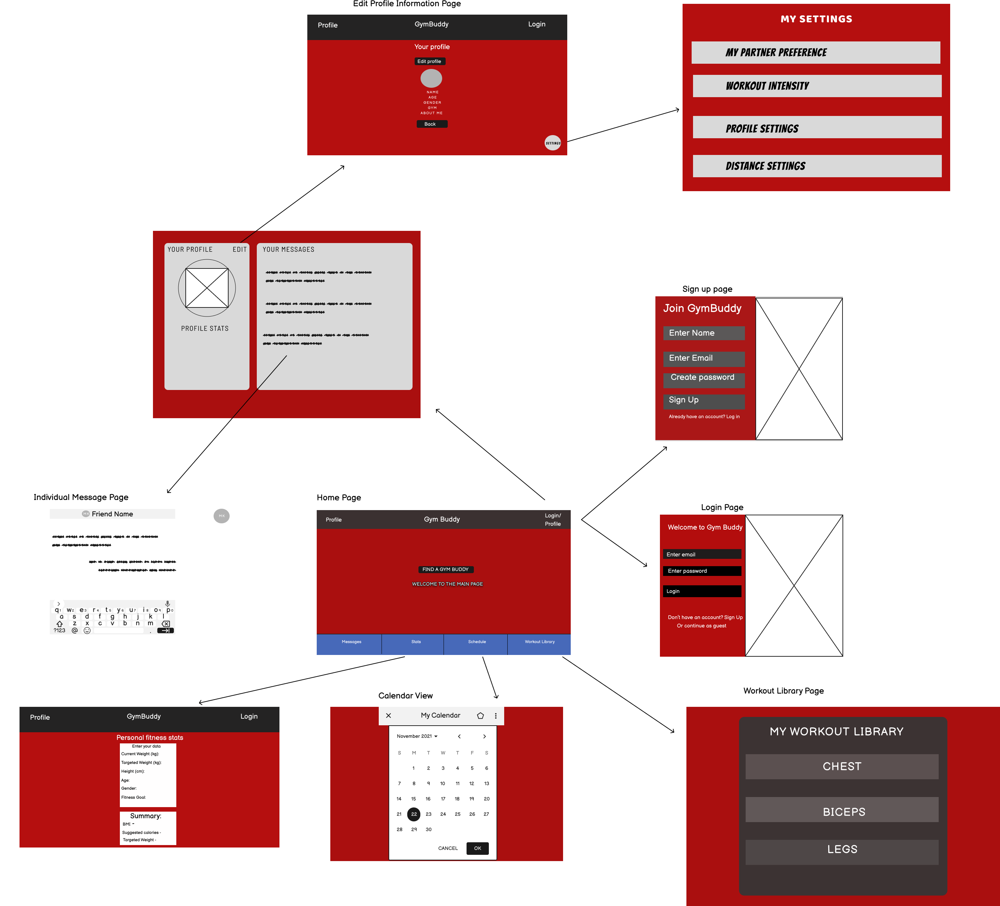

# Wireframes

These wireframes represent the current structure of the GymBuddy web application and show the core interaction flow that users are intended to follow throughout the platform. It begins with onboarding screens, including a sign-up and login interface, giving users the ability to create an account or log in to access their personalized dashboard.

Once authenticated, users arrive at the main home page, where they can navigate to different sections including their profile, match preferences, schedule/calendar, and workout library. The profile section allows users to view and edit their stats, view messages, and manage partner matching preferences such as workout intensity, distance, and partner availability. A dedicated settings menu provides access to fine tune those preferences for a better user experience.

From the navigation bar, users can also access their calendar to manage availability, and the workout library to organize exercises by muscle group.

These wireframes reflect our current design iteration and include improvements based on user feedback, such as clarified button labeling, reordered navigation, and layout adjustments that support a more intuitive user experience. We applied the concepts learned from phase 1 and the issues revealed to improve our design and make it more clear.
